# Nextify

## Bevezetés
A társammal egy olyan webshopot készítettünk amiben főként telefont és a telefonokhoz tartozó eszközöket árusítjuk. A Nextify webshopunk neve a jövő webáruházat jelenti.

Célunk nem csak egy sima telefont árusító weboldal, hanem a jövő technológiáját szeretné biztosítani a vásárlóknak. Törekedtünk az egyszerűségre, a minimalista és modern kinézetre és a responzitásra, hogy több eszközön ugyanolyan élményt tudjunk nyújtani.

A Nextify webshop egy teljes funkcionalitású webalkalmazás, amely lehetővé teszi a termékek böngészését, keresését, szűrését, valamint felhasználói vélemények megtekintését és írását.

A rendszer támogatja a kosárkezelést, rendelésleadást, valamint egy külön admin felületen keresztül a termékek, típusok, márkák, rendelések, akciók, vélemények teljes körű kezelését.

## Készítők

- Kis Alex János (User)
- Várady Kornélia Ibolya (Admin)

# Futtatás

## Letöltés
1. `git clone https://github.com/AlexKis20/Zarodolgozat.git`

## Adatbázis futtatása
1. Nyisd meg az XAMPP-ot.
2. Indítsd el az Apache webszervert.
3. Indítsd el a MySQL adatbázist.
4. Nyisd meg a phpMyAdmin-t (http://localhost/phpmyadmin/).
5. Importáld be az adatbázist (a `create database adatb/nextifyadatb.sql` fájlból).

## Backend futtatása
Az alábbi parancsokat kell kiadni terminálban. **! A PowerShell-ben nem működik !**
1. `cd backend`
2. `npm install`
3. `node backend.js`

## Frontend futtatása
Az alábbi parancsokat kell kiadni terminálban. **! A PowerShell-ben nem működik !**
1. `cd frontend`
2. `npm install`
3. `npm start`

# Főbb funkciók

**Nem bejelentkezett user:**

A nem bejelentkezett felhasználó is tud böngészni a webshopban és rá tud keresni a termékekre és természetesen értékelni is tud és megtudja nézni mások hozzászólásait.

**Bejelentkezett user:**

A bejelentkezett felhasználók a vendégekkel szemben többletfunkciókat érhetnek el: kizárólag ők tudják a termékeket kosárba helyezni, kezelni a kosár tartalmát (törlés), valamint véglegesíteni a rendelést.

**Admin:**

A bejelentkezett Adminnál megjelenik az Admin menü és számos olyan funkcó jelenik meg, ami az User felületen nem jelenik meg. Az User nem tud átlépni az Admin felületre.

## Felhasználói felület
A felhasználói felületet **Kiss Alex János** készítette.

A felhasználói felület a vásárlók által használt weboldal, ahol böngészhetnek a termékek között, szűrhetnek, és véleményt hagyhatnak.

### Termékek böngészése

Az oldal főoldalán a felhasználó megtekintheti az összes elérhető terméket.

Lehetséges műveletek:
- termékek listázása
- termékek szűrése márka alapján
- termékek szűrése típus alapján
- termékek keresése név és operációs rendszer alapján
- ár szerinti szűrés (minimum és maximum ár beállítása)

### Termék részletei

Amikor a felhasználó egy terméket kiválaszt, megtekintheti annak teljes részleteit:

Az elérhető információk:
- termék neve
- ár
- leírás
- szín
- kijelző mérete
- processzor típusa
- kapacitás (tárhely)
- operációs rendszer
- méret
- márka
- típus
- termék képe

### Vélemények és értékelések

Minden termékhez tartozhat felhasználói vélemény és értékelés.

Lehetséges műveletek:
- termék értékelésének megtekintése (átlag)
- a termékhez tartozó összes vélemény megtekintése
- új vélemény hozzáadása (értékeléssel és szöveggel)

### Hírek és blog

A felhasználó megtekintheti a weboldal hírek és blogbejegyzéseit három kategóriában:
- Hír bejegyzések
- Blog bejegyzések
- Akció bejegyzések

Minden bejegyzés tartalmaz:
- címet
- szöveget
- képet
- dátumot

### Kosár

A felhasználó a termékekből egy kosárba helyezheti a kívánt termékeket.

Lehetséges műveletek:
- termék hozzáadása a kosárhoz
- termék mennyiségének módosítása
- termék eltávolítása a kosárból
- kosár ürítése
- a kosár teljes árának megtekintése

A kosár az **localStorage-ben** tárolódik, így az adatok megmaradnak még a böngésző bezárása után is.

### Rendelés leadása

Miután a felhasználó összeállította a kívánt termékeket, a kosárból folytathat a rendelés leadáshoz.

A rendelés leadáshoz szükséges adatok:
- név
- szállítási cím
- telefonszám

Lehetséges műveletek:
- rendelés adatainak kitöltése
- rendelés végösszegének megtekintése
- rendelés véglegesítése

Miután a rendelés sikeresen leadásra kerül:
- a kosár kiürül
- a felhasználó megerősítő oldalt lát a rendelés adataival
- az adminisztrátor az "Rendelések kezelése" menüpontban megtekintheti és kezelheti a rendelést

## Admin felület
Az admin felületet **Várady Kornélia Ibolya** készítette.

Az admin felület célja, hogy a weboldal tartalmát és a rendszer működését egyszerűen lehessen kezelni.  
Az admin menü a bal oldalon található, ahol az adminisztrátor kiválaszthatja a kívánt műveletet.

### Vezérlőpult

Az első menüpont a **Vezérlőpult**.  
Itt láthatók a legfontosabb információk a rendszer működéséről, például:

- a beérkezett rendelések
- a felhasználók által írt vélemények

A megjelenített kártyák automatikusan változnak 10 másodpercenként, ha nincs aktivitás az oldalon.

### Kezdőlap kezelése

Ebben a menüpontban a kezdőlapon megjelenő **blogbejegyzéseket, híreket, megjelenést** lehet kezelni.

Lehetséges műveletek:
- keresés a bejegyzések között a cím alapján
- rendezés cím szerint növekvő vagy csökkenő sorrendben
- bejegyzések törlése
- meglévő bejegyzések módosítása
- új bejegyzés felvitele

### Termékek kezelése

Ebben a részben az adminisztrátor a webshop termékeit tudja kezelni.

Lehetséges műveletek:
- keresés a termék neve alapján
- rendezés név szerint növekvő vagy csökkenő sorrendben
- termék törlése
- meglévő termék módosítása
- új termék felvitele

A termékekhez tartozó adatok például:
- márka
- típus
- ár
- leírás
- szín

### Márkák kezelése

Ebben a menüpontban az adminisztrátor a rendszerben szereplő márkákat kezelheti.

Lehetséges műveletek:
- márka törlése
- meglévő márka módosítása
- új márka felvitele

### Típusok kezelése

A típusok kezelése menüpontban a termékekhez tartozó típusokat lehet kezelni.

Lehetséges műveletek:
- típus törlése
- típus módosítása
- új típus felvitele

### Rendelések kezelése

Ebben a részben a vásárlók által leadott rendelések jelennek meg.

A rendszer a következő adatokat tárolja:
- név
- telefonszám
- cím
- rendelés dátuma
- rendelés státusza

Ez segíti az adminisztrátort a rendelések állapotának nyomon követésében.

### Akciók kezelése

Az akciók menüpontban a különböző kedvezményeket lehet kezelni.

Az akciók adatai:
- akció neve
- akció mértéke
- kezdete
- vége

Lehetséges műveletek:
- akció megtekintése
- akció törlése
- akció módosítása
- új akció felvitele

### Vélemények kezelése

Ebben a menüpontban a felhasználók által írt termékértékelések jelennek meg.

Megjelenő adatok:
- dátum
- felhasználó
- termék
- vélemény szövege
- értékelés

Az adminisztrátor ezeket a véleményeket:
- megtekintheti
- törölheti

**Az admin felület összes funkciója elérhető mobilon, tableten is.**

# Architektúra

## Adatbázis
Az alkalmazás **Mysql**-t használ.

**Fejlesztői eszközök:**
| Eszköz     | Feladata                                                                  |
|------------|---------------------------------------------------------------------------|
| XAMPP      | Az adatbázis szerver és a phpmyadmin-hoz szükséges webszerver elindítása. |
| phpmyadmin | Az adatbázis kezelése.                                                    |

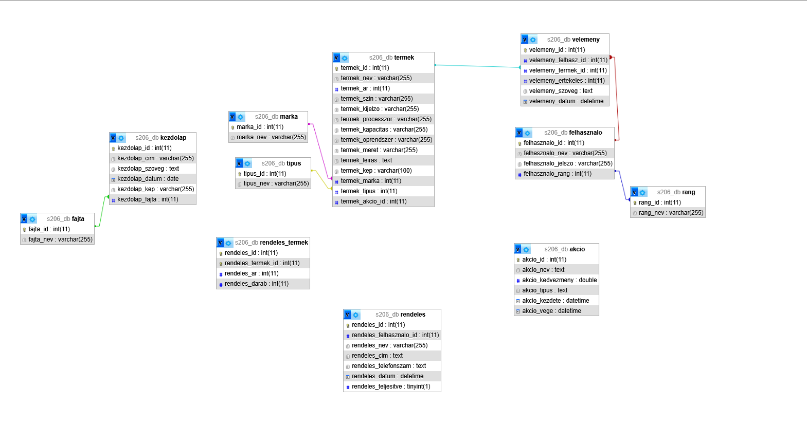
## Backend

**Fejlesztői eszközök:**
| Eszköz  | Feladata                       |
|---------|--------------------------------|
| Node.js | A backendet futtató környezet. |
| npm     | Függőségek kezelése.           |

**Külső könyvtárak:**
| Könyvtár     | Feladata                                       |
|--------------|------------------------------------------------|
| bcrypt       | Jelszavak hashelése.                           |
| cors         | CORS fejlécek beállítása a HTTP válaszokban.   |
| express      | Node.js web keretrendszer.                     |
| jsonwebtoken | Tokenek kezelése az authentikációhoz.          |
| mysql        | Lehetővé teszi a csatlakozást az adatbázishoz. |
| multer       | Fájl feltöltések kezelése.                     |

## Frontend

**Fejlesztői eszközök:**
| Eszköz  | Feladata                        |
|---------|---------------------------------|
| Node.js | A frontendet futtató környezet. |
| npm     | Függőségek kezelése.            |

**Külső könyvtárak:**
| Könyvtár          | Feladata                                               |
|-------------------|--------------------------------------------------------|
| bootstrap         | CSS keretrendszer az alapvető stílusozáshoz.           |
| framer-motion     | Animációk és mozgások létrehozásához.                  |
| lucide-react      | Ikon könyvtár.                                         |
| react             | JavaScript könyvtár a felhasználói felület építéséhez. |
| react-dom         | A React komponensek DOM-ba való renderelése.           |
| react-icons       | Ikon könyvtár React komponensekhez.                    |
| react-router-dom  | Oldaltovábbítás és URL kezelése.                       |
| react-scripts     | Build eszközök és skriptek a Create React App-hez.     |
| styled-components | CSS-in-JS megoldás a komponens stílusozásához.         |

## Backend végpontok

Készítette:
- User végpontok: **Kiss Alex János**
- Admin végpontok: **Várady Kornélia Ibolya**

| HTTP metódus | API Végpont                    | Leírás                                                  | Típus |
|--------------|--------------------------------|---------------------------------------------------------|-------|
| GET          | /termek                        | Összes termék lekérdezése                               | User  |
| GET          | /termek/:termek_id             | Egy termék lekérdezése ID alapján                       | User  |
| GET          | /tipus                         | Összes típus lekérdezése                                | User  |
| GET          | /tipus/:tipus_id               | Egy típus lekérdezése ID alapján                        | User  |
| POST         | /tipusuTermek                  | Termékek lekérdezése típus alapján                      | User  |
| GET          | /marka                         | Összes márka lekérdezése                                | User  |
| GET          | /marka/:marka_id               | Egy márka lekérdezése ID alapján                        | User  |
| POST         | /markajuTermek                 | Termékek lekérdezése márka alapján                      | User  |
| POST         | /termeknevKeres                | Termékek keresése név és ár alapján                     | User  |
| POST         | /termekSelectIn                | Termékek lekérdezése ID lista alapján                   | User  |
| GET          | /hirek1                        | Hírek lekérdezése (1. fajta)                            | User  |
| GET          | /hirek2                        | Hírek lekérdezése (2. fajta)                            | User  |
| GET          | /hirek3                        | Hírek lekérdezése (3. fajta)                            | User  |
| POST         | /ujVelemeny                    | Új vélemény hozzáadása                                  | User  |
| GET          | /velemenyAtlag/:termekId       | Vélemény átlagának lekérdezése                          | User  |
| GET          | /velemenyek/:termekId          | Vélemények lekérdezése termék alapján                   | User  |
| GET          | /felhasznalo                   | Összes felhasználó lekérdezése                          | Admin |
| GET          | /kezdolap                      | Összes kezdőlap/blog bejegyzés lekérdezése              | Admin |
| GET          | /kezdolap/:kezdolap_id         | Egy kezdőlap/blog bejegyzés lekérdezése                 | Admin |
| DELETE       | /kezdolapTorles/:kezdolap_id   | Kezdőlap/blog bejegyzés törlése                         | Admin |
| PUT          | /kezdolapModosit/:kezdolap_id  | Kezdőlap/blog bejegyzés módosítása                      | Admin |
| POST         | /kezdolapHozzaad               | Új kezdőlap/blog bejegyzés hozzáadása                   | Admin |
| GET          | /fajta                         | Összes fajta lekérdezése                                | Admin |
| DELETE       | /termekTorles/:termek_id       | Termék törlése                                          | Admin |
| PUT          | /termekModosit/:termek_id      | Termék módosítása                                       | Admin |
| POST         | /termekHozzaad                 | Új termék hozzáadása                                    | Admin |
| DELETE       | /tipusTorles/:tipus_id         | Típus törlése                                           | Admin |
| PUT          | /tipusModosit/:tipus_id        | Típus módosítása                                        | Admin |
| POST         | /tipusHozzaad                  | Új típus hozzáadása                                     | Admin |
| DELETE       | /markaTorles/:marka_id         | Márka törlése                                           | Admin |
| PUT          | /markaModosit/:marka_id        | Márka módosítása                                        | Admin |
| POST         | /markaHozzaad                  | Új márka hozzáadása                                     | Admin |
| GET          | /rendeles                      | Összes rendelés lekérdezése                             | Admin |
| GET          | /rendeles/:rendeles_id         | Egy rendelés lekérdezése ID alapján                     | Admin |
| GET          | /rendelesTermekek/:rendeles_id | Rendelés termékei lekérdezése                           | Admin |
| DELETE       | /rendelesTorles/:rendeles_id   | Rendelés törlése                                        | Admin |
| PUT          | /rendelesModosit/:rendeles_id  | Rendelés módosítása                                     | Admin |
| POST         | /rendelesHozzaad               | Új rendelés hozzáadása termék nélkül                    | Admin |
| POST         | /rendelesHozzaadTermekkel      | Új rendelés hozzáadása termékekkel                      | Admin |
| POST         | /rendelesTermekHozzaad         | Rendelés termék hozzáadása                              | Admin |
| GET          | /akcioMinden                   | Összes akció lekérdezése                                | Admin |
| GET          | /akcio/:akcio_id               | Egy akció lekérdezése ID alapján                        | Admin |
| GET          | /akcioTermekek/:akcio_id       | Akció termékei lekérdezése                              | Admin |
| DELETE       | /akcioTorles/:akcio_id         | Akció törlése                                           | Admin |
| PUT          | /akcioModosit/:akcio_id        | Akció módosítása                                        | Admin |
| POST         | /akcioHozzaad                  | Új akció hozzáadása                                     | Admin |
| GET          | /velemeny                      | Összes vélemény lekérdezése                             | Admin |
| GET          | /velemenyMinden                | Összes vélemény lekérdezése felhasználóval és termékkel | Admin |
| GET          | /velemeny/:velemeny_id         | Egy vélemény lekérdezése ID alapján                     | Admin |
| DELETE       | /velemenyTorles/:velemeny_id   | Vélemény törlése                                        | Admin |

# Képek

## Képek a felhasználó felületről

| Kép | Leírás |
|-----|--------|
| 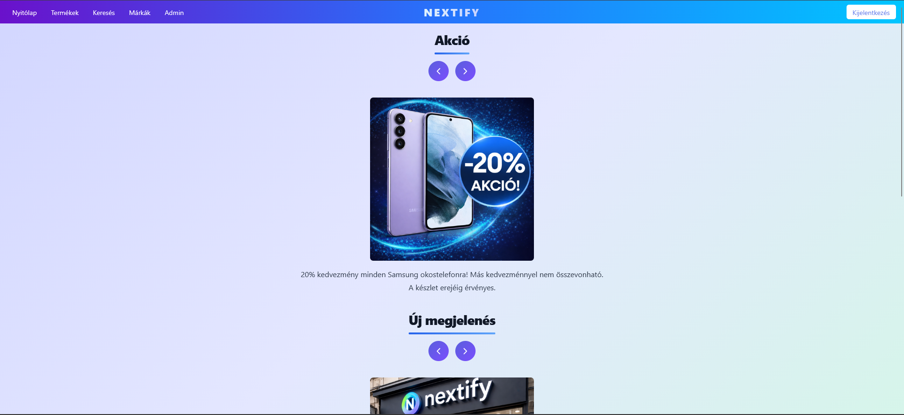 | A webshop főoldala, ahol a felhasználók láthatják az akciókat, híreket és blog bejegyzéseket. |
| 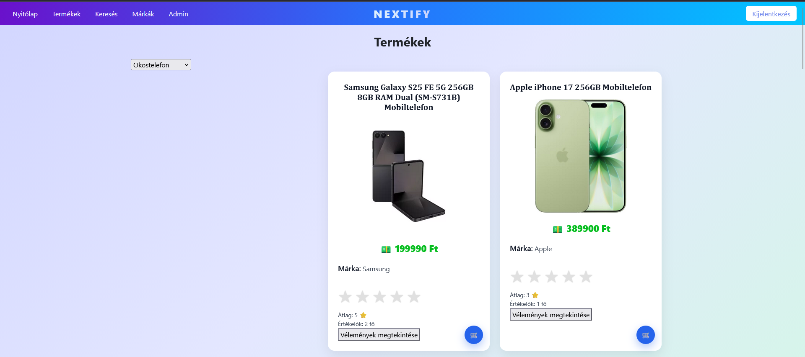 | A termékek listázása és szűrésének oldala. |
| 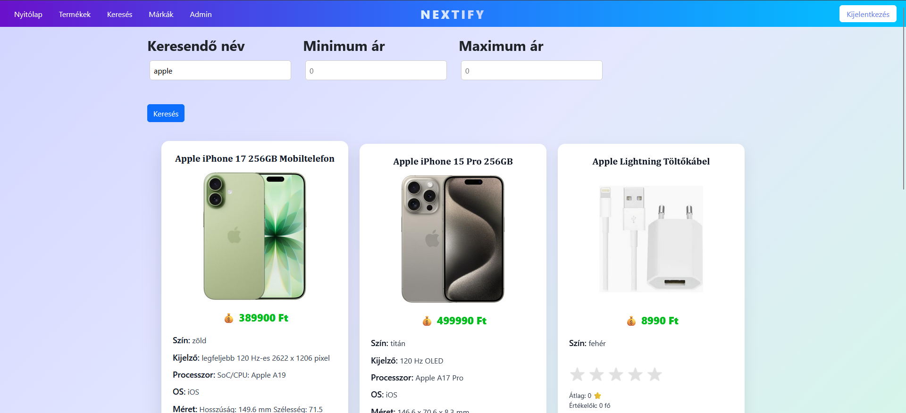 | A termékek keresésének funkcionalitása. |
| 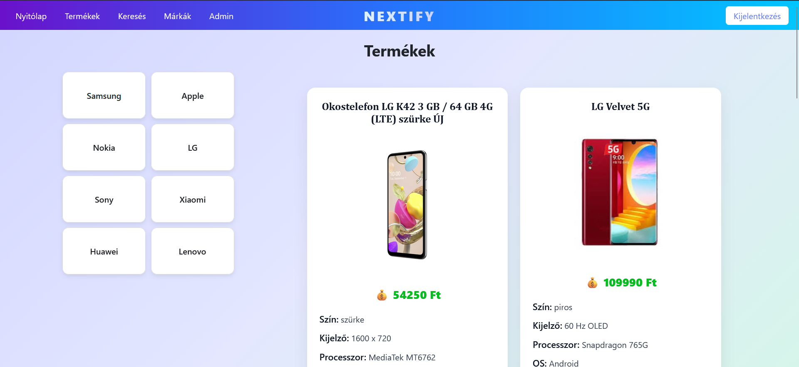 | A márkák szerinti szűrési lehetőség. |
| 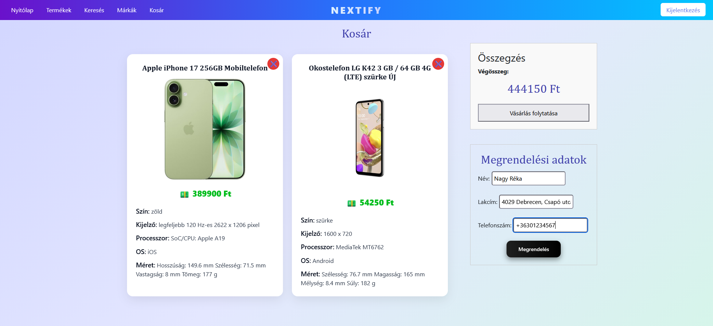 | A kosár oldala, ahol a felhasználó módosíthatja a kiválasztott termékeket és leadhatja a rendelését. |
| 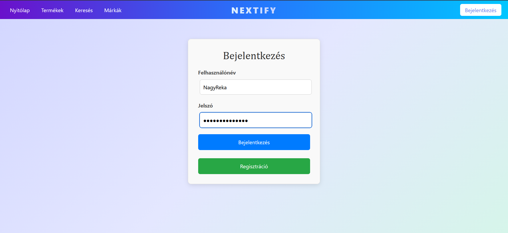 | A felhasználó bejelentkezési oldala. |
| 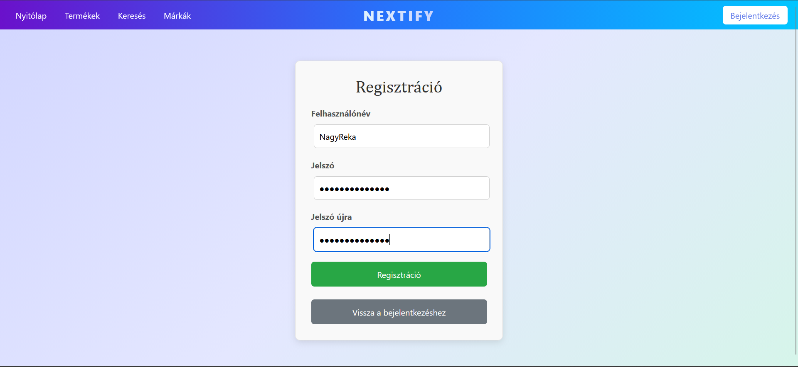 | A felhasználó regisztrációs oldala. |
| 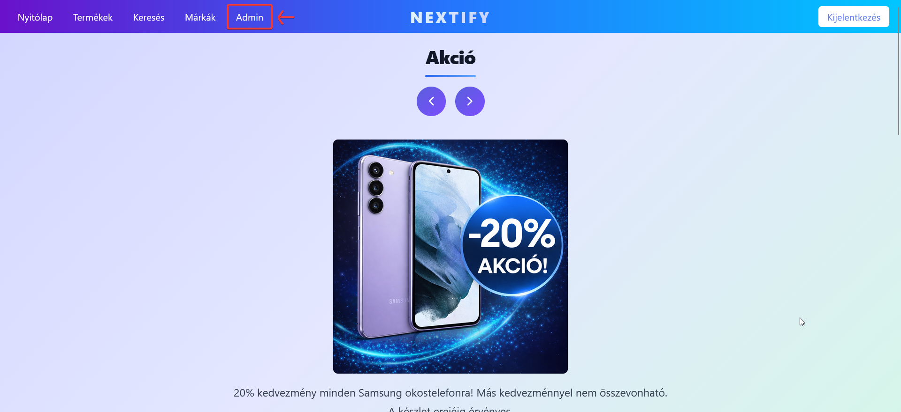 | Az admin gomb megjelenítése bejelentkezett adminisztrátor számára. |
|  | Az admin gomb nem jelenik meg normál felhasználó számára. |

## Képek az Admin felületről

| Kép | Leírás |
|-----|--------|
| 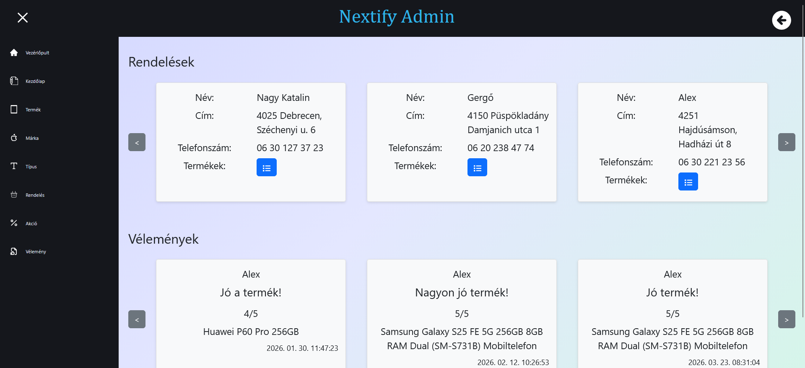 | Az admin panel vezérlőpultja a bejövő rendelésekkel és véleményekkel. ||
| 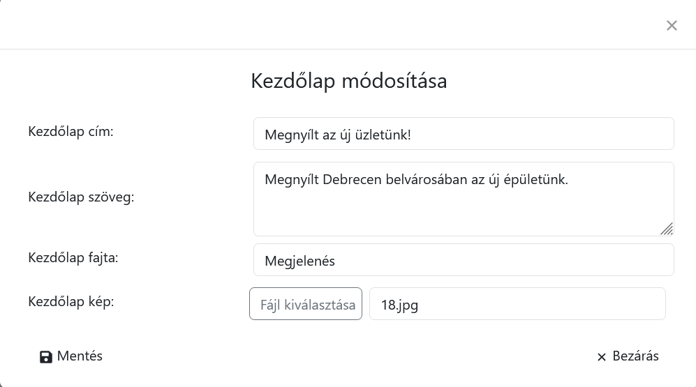 | Képfájl feltöltésének funkciója az admin panelen. |
| 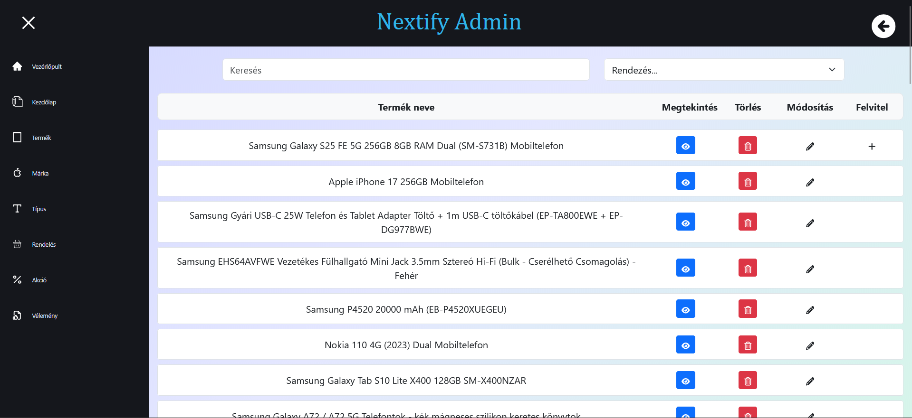 | Termékek oldala. |
| 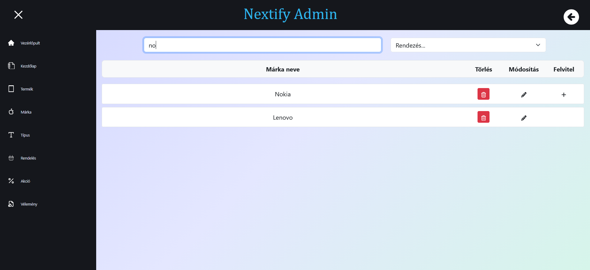 | Az admin panelen a keresési funkció. |
| 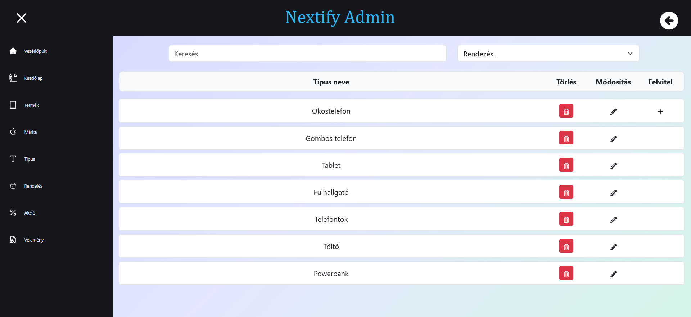 | Az admin panelen tipus oldala. |
| 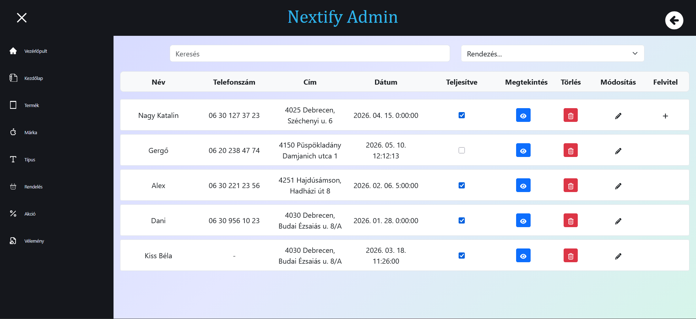 | Az admin panelen rendelés oldala. |
| 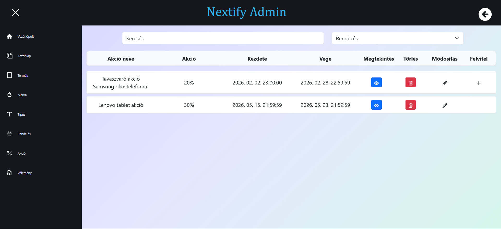 | Az admin akciókezelési oldala. |
| 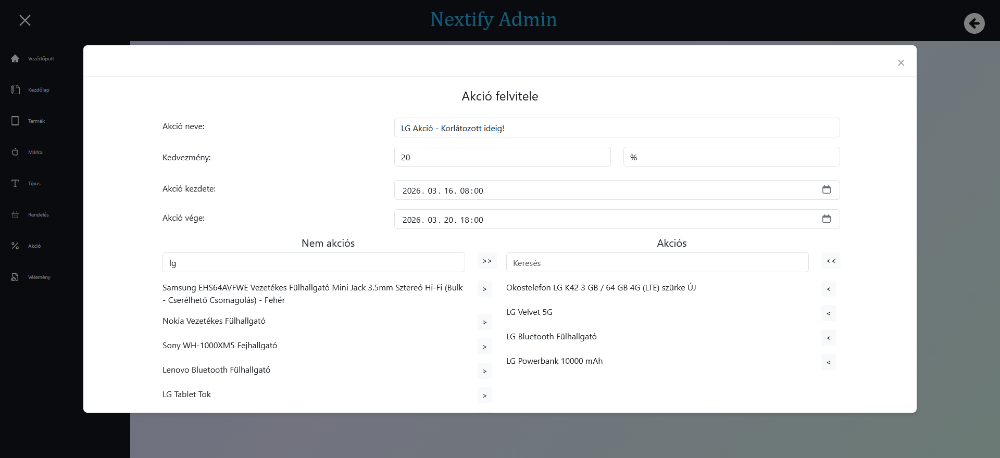 | Új akció felvitelének oldala. |
| 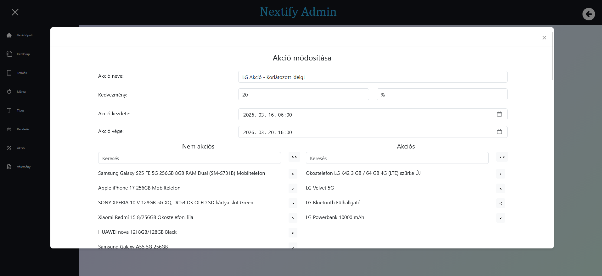 | Akció módosításának oldala. |
| 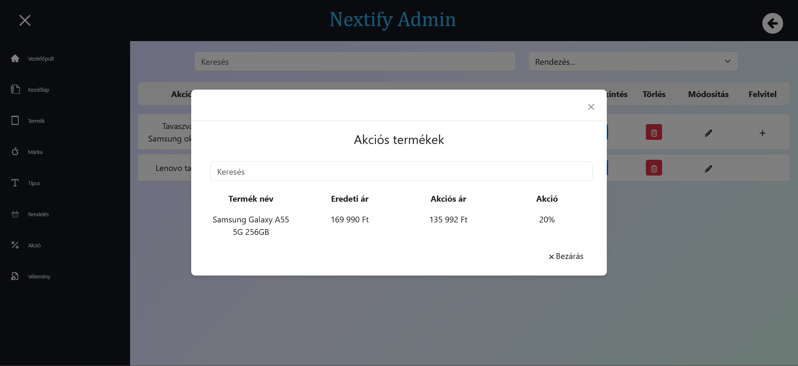 | Az akcióhoz tartozó termékek kezelésének oldala. |
| 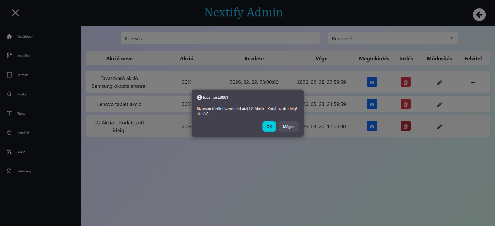 | Az akció törlésére vonatkozó megerősítési dialógus. |
| 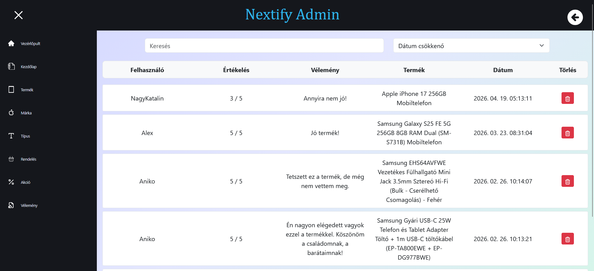 | Az admin panelen a rendezési funkció. |
| 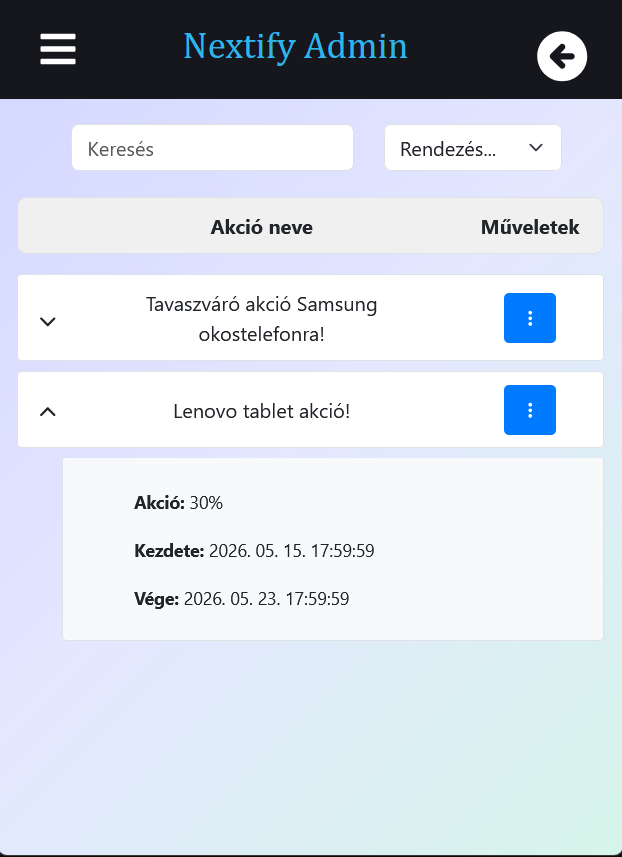 | Az akciók oldala mobil eszközön. |
| 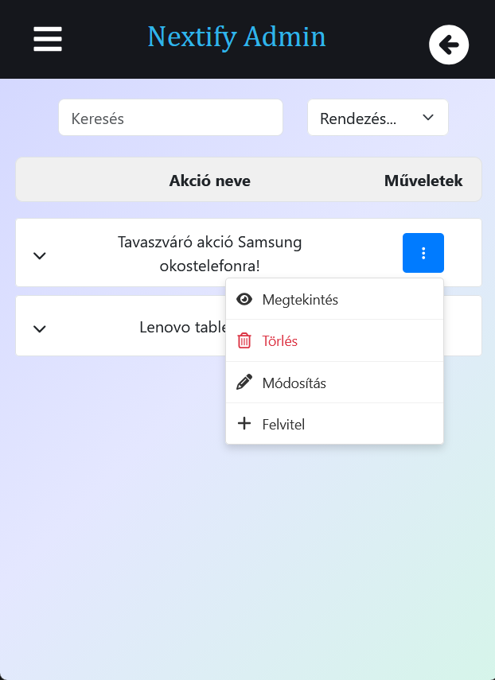 | A műveletek gomb mobil nézeten. |

# Szerzői jog és licenc

## Jogok

Ez a projekt **Kis Alex János** és **Várady Kornélia Ibolya** szerzői munkája. A projekt összes szellemi tulajdona, beleértve az alábbi elemeket, fenntartott jogok alatt állnak:

- Forráskód (Frontend és Backend)
- Adatbázis séma és adatok
- Felhasználói felület dizájnja és layoutja
- Szoftver architektúra és dokumentáció
- Képernyőképek és vizuális anyagok

## Felhasználási feltételek

A projekt **csak oktatási és személyes tanulmányi célokra** használható. A projekt bármilyen formában történő használata, módosítása, terjesztése vagy kereskedelmi célú felhasználása **csak az eredeti szerzők kifejezett írásos engedélyével** lehetséges.

**Kivétel: a vizsgabizottság tagjai a projektet szabadon megtekinthetik és értékelési célból felhasználhatják, külön engedély nélkül.**

### Tiltott tevékenységek:

- A projekt vagy annak részeinek másolása és terjesztése
- Kereskedelmi célokra történő felhasználás
- Forráskód vagy szoftver publikálása harmadik féllel
- A projekt alapján új alkalmazások vagy szolgáltatások létrehozása
- Szerzői jog vagy licencinformációk eltávolítása vagy módosítása

### Engedély kéréshez vegyenek fel kapcsolatot:

- **Kis Alex János**
- **Várady Kornélia Ibolya**

## Felelősség korlátozása

A projekt **"JELENLEGI ÁLLAPOTBAN"** kerül biztosításra, anélkül hogy bármilyen garancia vagy szavatosság lenne. A szerzők **nem felelősek** az alkalmazás használatából eredő közvetlen vagy közvetett károkért.